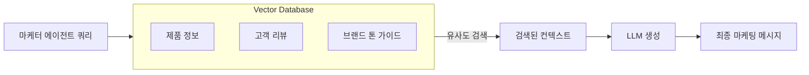
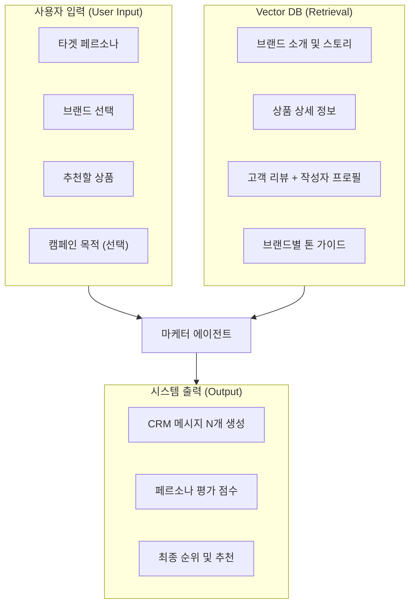
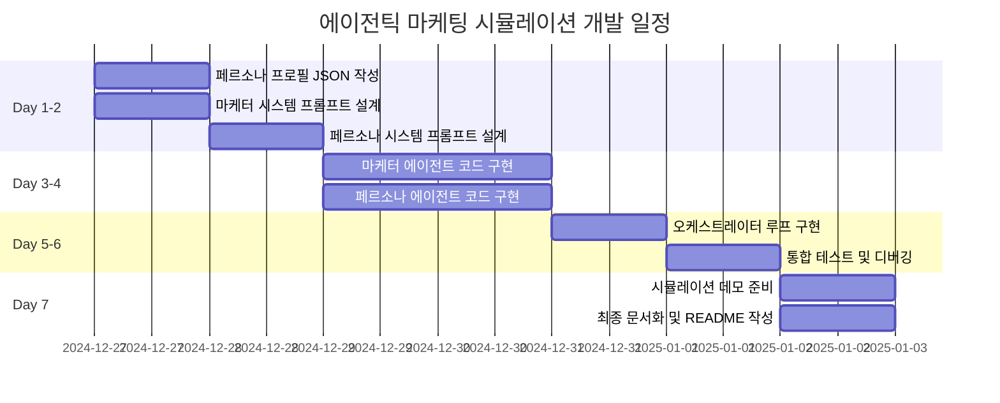

# 에이전틱 마케팅 시뮬레이션 프레임워크 (Agentic CRM)
> **프로젝트**: 아모레퍼시픽 뉴럴 추천 시스템 & 에이전틱 CRM  
> **핵심 컨셉**: "적대적 생성 마케팅 (Adversarial Marketing Generation)" - GAN 모델처럼 경쟁하며 진화하는 메시지

---

## 1. 핵심 컨셉: 마케팅의 GAN 모델화

이 프레임워크의 핵심은 **생성형 AI 모델(GAN)**의 구조를 마케팅 업무에 차용한 것입니다.

| 역할 | GAN 모델 | 마케팅 시뮬레이션 |
|---|---|---|
| **생성자 (Generator)** | 가짜 이미지 생성 | 마케터 에이전트가 CRM 메시지 생성 |
| **판별자 (Discriminator)** | 진짜/가짜 판별 | 페르소나 에이전트가 구매 의향 판별 |

이 두 에이전트가 서로 **적대적(Adversarial)**으로 상호작용하며 루프를 돌 때, 사람이 개입하지 않아도 메시지의 품질(CTR/전환율)은 극대화됩니다.

---

## 2. 해결하고자 하는 문제 (Challenge)

### 🛑 기존 마케팅의 한계
*   **낮은 전환율**: 불특정 다수에게 보내는 CRM은 클릭률 1% 미만.
*   **A/B 테스트 비용**: 실제 고객 대상 실험은 예산과 브랜드 피로도를 소모.
*   **"왜?"를 알 수 없음**: 캠페인 실패 시 구체적인 이유 파악 불가.

### 💡 솔루션: 가상 시뮬레이션
실제 고객에게 보내기 전, **가상 공간(Virtual Sandbox)**에서 에이전트끼리 치열하게 모의 전투를 치릅니다.

---

## 3. 솔루션 아키텍처

```mermaid
flowchart TD
    A[클라이언트] -->|1. 타겟 및 목표 설정| B[오케스트레이터]
    
    subgraph Optimization["Phase 1: 퀄리티 고도화 (Quality)"]
        B -->|2. 미션 하달| C["마케터 (Generator)"]
        C -->|3. 메시지 초안| D["수석 페르소나 (Critic)"]
        D -->|4. 상세 피드백 (Why?)| C
        C -->|5. 수정 및 개선| C
    end
    
    subgraph Validation["Phase 2: 가상 A/B 테스트 (Quantity)"]
        C -->|6. 최종 메시지| E7["페르소나 1 (Click?)"]
        C -->|6. 최종 메시지| E8["페르소나 2 (Click?)"]
        C -->|6. 최종 메시지| E9["페르소나 N (Click?)"]
        
        E7 & E8 & E9 -->|7. 투표 (O/X)| F[통계 엔진]
    end
    
    F -->|8. 예상 CTR 및 리포트| A
```

### 핵심 전략: 질(Quality)과 양(Quantity)의 조화
1.  **Phase 1 (생성 & 튜닝)**: "수석 페르소나" 1명이 **선생님**처럼 구체적으로 지도합니다. (상세 피드백)
2.  **Phase 2 (검증 & 예측)**: "대중 페르소나" 10명~100명이 **가상 고객**이 되어 클릭 여부만 투표합니다. (클릭률 예측)
    *   *이 데이터(Click/No Click)는 추후 모델 학습의 보상(Reward) 신호로 완벽하게 작동합니다.*

---

## 4. RAG (Retrieval-Augmented Generation) 적용

단순 프롬프팅이 아닌, **실제 데이터 기반의 지식 검색**을 통해 메시지 품질을 높입니다.

### RAG 파이프라인 구조



### RAG 적용 포인트 3가지

| 용도 | 검색 대상 | 효과 |
|---|---|---|
| **제품 추천 근거** | `products.json` (제품명, 가격, 성분, 효능) | 페르소나에 맞는 제품을 **정확하게** 추천 |
| **감성적 표현** | `reviews` (고객 리뷰 7,000+건) | 실제 고객이 쓴 표현을 참고하여 **자연스러운 문장** 생성 |
| **브랜드 톤 유지** | `brand_tone_guide.json` (브랜드별 말투 규칙) | 설화수는 고급스럽게, 이니스프리는 친근하게 **톤 자동 조절** |

### 예시: RAG가 없을 때 vs 있을 때

**Without RAG (단순 프롬프팅)**
> "설화수 자음생크림을 추천드립니다. 좋은 제품입니다."

**With RAG (리뷰 기반)**
> "20년째 자음생크림만 쓰고 있어요. 악건성에 속건조까지 힘든 피부인데, 늘 함께해줘서 고마운 크림입니다." (실제 리뷰 참고)

### 구현 태스크 (RAG)
- [ ] **Vector DB 구축**: ChromaDB 또는 FAISS로 제품/리뷰 임베딩
- [ ] **브랜드 톤 가이드 작성**: 15개 브랜드별 말투 규칙 JSON
- [ ] **Retriever 연동**: LangChain `RetrievalQA` 체인 구성
- [ ] **Hybrid Search**: 키워드 + 벡터 검색 조합 (더 정확한 검색)

---

## 5. 데이터 아키텍처 (Input / DB / Output)

CRM 마케팅 SaaS 관점에서 **어떤 정보를 사용자에게 받고**, **어떤 정보를 DB에서 검색하고**, **무엇을 출력할지** 정의합니다.

### 데이터 흐름도



### 데이터 분류표

| 구분 | 데이터 항목 | 형식 | 설명 |
|---|---|---|---|
| **사용자 입력** | 페르소나 | Enum/ID | 5~10개 중 선택 (예: `Brand_Fan`, `Sensitive`) |
| | 브랜드 | Enum | 설화수, 라네즈, 이니스프리 등 15개 |
| | 상품 | Product ID | 추천하고 싶은 특정 상품 선택 |
| | 캠페인 목적 | Text (선택) | "신제품 출시", "재구매 유도" 등 |
| **DB 저장 (RAG)** | 브랜드 스토리 | Text | 각 브랜드의 역사, 철학, 핵심 가치 |
| | 상품 정보 | JSON | 제품명, 가격, 성분, 효능, 카테고리 |
| | 고객 리뷰 | Text + Profile | 리뷰 본문 + 작성자 피부타입/연령대/고민 |
| | 톤 가이드 | JSON | 브랜드별 말투 규칙 (예: "설화수=존대, 고급") |
| **시스템 출력** | CRM 메시지 | Text | 제목 40자, 내용 350자 형식 |
| | 페르소나 평점 | Score (1-10) | 해당 페르소나가 메시지에 반응할 확률 |
| | 피드백 이유 | Text | "가격 강조가 과함", "톤이 딱딱함" 등 |

### 예시: 입력 → 출력 플로우

**입력:**
- 페르소나: `Sensitive` (민감성 피부)
- 브랜드: `에스트라`
- 상품: `아토베리어 365 크림`

**RAG 검색:**
- 브랜드 스토리: "피부과 전문의와 공동 연구로 탄생한 더마 브랜드"
- 리뷰: "아토피가 심한데 이 크림만 쓰면 진정돼요" (40대/여성/극건성)
- 톤: 신뢰감, 전문성, 순함 강조

**출력:**
```
[제목] 피부과 전문의가 만든 진정 크림, 아토베리어
[내용] 아토피 때문에 늘 예민했던 피부, 이제 편안해질 시간이에요. 
많은 분들이 "이 크림만 쓰면 진정된다"고 말씀하시는 이유, 
직접 경험해보세요. 지금 첫 구매 시 10% 할인 혜택까지!
```

---

## 6. 에이전트 역할 정의

### 마케터 에이전트 (Generator)
*   **역할**: 설득의 달인. 페르소나의 지갑을 열게 만드는 것이 목표.
*   **행동**: 제품 USP 파악 → 톤앤매너 조절 → 피드백 반영하여 개선.

### 페르소나 에이전트 (Discriminator)
*   **역할**: 까다로운 고객. 자신의 취향이 아니면 절대 넘어가지 않음.
*   **정의**: 클러스터링으로 찾은 5가지 페르소나 데이터 주입.
*   **행동**: 구매 시뮬레이션 (Yes/No) + 상세 피드백 제공.

### 오케스트레이터 (Judge)
*   **역할**: 심판. 무한 루프 방지 및 최적 합의점에서 종료.

---

## 5. 기대 효과

| 특징 | 이점 |
|---|---|
| **리스크 제로 테스트** | 실제 고객에게 스팸을 보내지 않고도 과감한 마케팅 시도 가능 |
| **정성적 인사이트** | 고객이 왜 이 문구를 싫어하는지 언어적 이유 파악 가능 |
| **초개인화 자동화** | 5개 페르소나에 5가지 다른 메시지를 1분 만에 생성 |
| **GAN 메커니즘** | 생성자와 판별자가 경쟁하며 메시지 퀄리티 점진적 고도화 |

---

## 6. 구현 태스크 리스트

### 마케터 에이전트 (Generator) 구현
- [ ] **시스템 프롬프트 설계**: 마케터 역할, 목표(CTR 최대화), 제약조건 정의
- [ ] **입력 스키마 정의**: 제품 정보, 프로모션 내용, 타겟 페르소나 요약
- [ ] **출력 스키마 정의**: 제목, 본문, 이모지 사용 여부, 발송 시간대 추천
- [ ] **LLM 연동**: OpenAI/Gemini API 연결 및 프롬프트 체이닝
- [ ] **피드백 수용 로직**: 페르소나 피드백을 반영하여 메시지 수정하는 루프 구현

### 페르소나 에이전트 (Discriminator) 구현
- [ ] **페르소나 프로필 JSON 생성**: 5개 페르소나별 성격/취향/제약조건 데이터
- [ ] **시스템 프롬프트 설계**: 특정 페르소나로 빙의하여 반응하도록 지시
- [ ] **평가 출력 스키마**: 구매 의향 점수(1-10), 구매 여부(Y/N), 피드백 사유
- [ ] **일관성 검증**: 동일 메시지에 동일 페르소나가 일관된 반응을 보이는지 테스트
- [ ] **다중 페르소나 지원**: 5개 페르소나를 순차적으로 호출하는 배치 로직

### 오케스트레이터 구현
- [ ] **루프 제어 로직**: 최대 3턴 제한, 점수 임계값 도달 시 조기 종료
- [ ] **로그 저장**: 각 턴별 메시지와 피드백을 JSON으로 기록
- [ ] **최종 리포트 생성**: 최적 메시지, 예상 CTR, 페르소나별 반응 요약

---

## 6. 자가 발전 루프 (Self-Evolving Workflow)

에이전트가 생성한 성공적인 데이터는 **모델 자체를 똑똑하게 만드는 학습 데이터**가 됩니다.

### LoRA 파인튜닝 파이프라인

Ollama는 **실행(Inference)** 도구이므로, 학습(Training)은 외부 파이썬 스크립트로 진행 후 결과물만 Ollama에 탑재합니다.

```mermaid
flowchart TD
    subgraph Online["실시간 (Online)"]
        G[마케터 에이전트] -->|초안 작성| D[페르소나 판별자]
        D -->|피드백/수정| G
        G -->|최종 승인 (Score 9+)| LogDB[(로그 데이터베이스)]
    end
    
    subgraph Offline["오프라인 학습 (Offline)"]
        LogDB -->|데이터 정제| Train[LoRA 학습 (Unsloth/PEFT)]
        Train -->|Adapter 생성| GGUF[GGUF 변환/병합]
    end
    
    GGUF -->|Modelfile 업데이트| Ollama[Ollama 모델 교체]
    Ollama -.->|성능 향상| G
```

1.  **데이터 수집**: "판별자가 9점 이상 준 메시지"만 모아서 `good_cases.json`으로 저장.
2.  **LoRA 학습**: `Unsloth` (학습 속도 2배) 라이브러리를 사용해 마케터 모델(`Llama 3`)을 파인튜닝.
    *   *효과: "더 이상 긴 프롬프트(In-Context Learning) 없이도, 알아서 아모레퍼시픽 톤을 구사하게 됨"*
3.  **Ollama 탑재**: 학습된 LoRA 어댑터를 Ollama `Modelfile`에 등록하여 배포.

---

## 7. 1주일 타임라인



| 일차 | 주요 작업 | 산출물 |
|---|---|---|
| **Day 1** | 페르소나 프로필 JSON 작성, 마케터 프롬프트 초안 | `personas.json`, `marketer_prompt.txt` |
| **Day 2** | 페르소나 프롬프트 설계, 평가 스키마 정의 | `persona_prompt.txt`, `evaluation_schema.json` |
| **Day 3** | 마케터 에이전트 코드 구현 (LangChain) | `agents/marketer.py` |
| **Day 4** | 페르소나 에이전트 코드 구현 | `agents/persona.py` |
| **Day 5** | 오케스트레이터 구현, 루프 연결 | `orchestrator.py` |
| **Day 6** | 통합 테스트, 버그 수정, 로그 검증 | 테스트 리포트 |
| **Day 7** | 데모 시나리오 준비, README 최종화 | 데모 영상/스크린샷, `README.md` |
