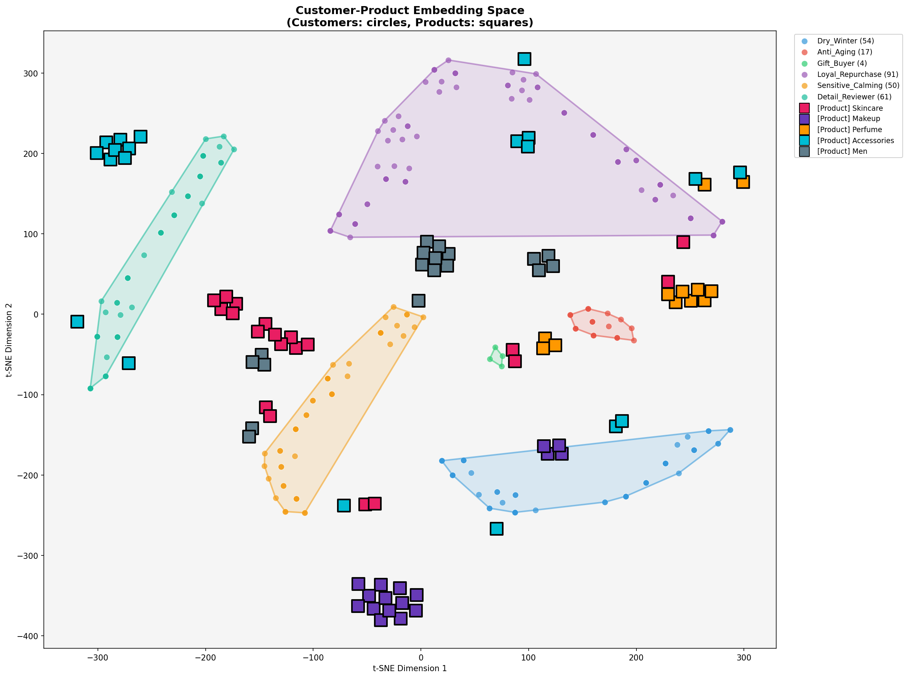
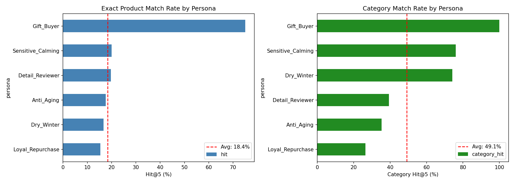

# 🛍️ Neural Recommendation System

**Two-Tower 아키텍처 기반 개인화 상품 추천 시스템**

> 아모레몰 고객 리뷰 데이터를 활용한 페르소나 기반 추천 엔진


---

## 📊 Results

| Metric | Score |
|--------|-------|
| **Hit@3** | 19.9% |
| **Category Hit@3** | 52.3% |

<p align="center">
  
  
</p>

---

## 🎯 Overview

### 문제 상황
- 고객 리뷰어 ID가 없어 협업 필터링 적용 불가
- 277개의 적은 상호작용 데이터

### 해결 방법
- **페르소나 기반 추천**: 고객 특성(나이, 성별, 피부타입)으로 유사도 계산
- **Two-Tower 아키텍처**: Customer Tower + Product Tower로 임베딩 학습
- **Triplet Loss**: Metric Learning으로 유사한 고객-상품 쌍 학습

---

## 🏗️ Architecture

```
┌─────────────────────┐     ┌─────────────────────┐
│   Customer Tower    │     │   Product Tower     │
│                     │     │                     │
│  [age, gender,      │     │  [category, brand,  │
│   skin_type,        │     │   price]            │
│   skin_concern]     │     │                     │
│         ↓           │     │         ↓           │
│   Embedding(16d)    │     │   Embedding(16d)    │
│         ↓           │     │         ↓           │
│   MLP(64→32)        │     │   MLP(64→32)        │
│         ↓           │     │         ↓           │
│   L2 Normalize      │     │   L2 Normalize      │
└─────────┬───────────┘     └───────────┬─────────┘
          └──────────┬──────────────────┘
                     ↓
              Cosine Similarity
```

---

## 📁 Project Structure

```
.
├── neural_recsys/
│   ├── model.py            # Two-Tower 모델
│   ├── trainer.py          # 학습 파이프라인
│   ├── evaluator.py        # 평가 메트릭 (Hit@K)
│   ├── recommender.py      # 추천 API
│   ├── visualizer.py       # t-SNE 시각화
│   └── customer_generator.py
├── data/
│   ├── products.json       # [NEW] 772개 제품 + 7,000개 리뷰 + 상세 메타데이터
│   ├── images/             # [NEW] 제품별 고화질 이미지 폴더 (2GB+)
│   ├── customers.json      # 가상 고객 프로필
│   └── amoremall_reviews.json
├── model.pth               # 학습된 가중치
├── TECHNICAL_DOCUMENTATION.md
└── PERSONA_DEFINITION.md
```

---

## 🎯 CRM Generator

AI 기반 B2B CRM 마케팅 메시지 자동 생성 시스템

### Features
- **RAG 기반 컨텍스트 검색**: 브랜드 스토리, 제품 정보, 고객 리뷰 자동 분석
- **Multi-LLM 지원**: Gemini, Ollama Cloud, OpenAI 선택 가능
- **3개 후보 생성**: 친근한 / 전문적 / 트렌디 톤 동시 제안

### Data (2024.12.29 업데이트)
- 772개 제품 (아모레몰 URL에서 직접 브랜드 추출)
- 29개 브랜드 스토리 (톤앤매너, 비주얼 컬러 정의)
- 5개 CRM 예시 (카카오톡 마케팅 스타일)

👉 자세한 내용은 [crm_generator/README.md](./crm_generator/README.md) 참고

---

## 🚀 Quick Start

### 1. 설치

```bash
pip install torch pandas numpy scikit-learn matplotlib seaborn
```

### 2. 추천 받기

```python
from neural_recsys.recommender import Recommender

rec = Recommender()

# 고객 정보 입력 → 상품 추천
results = rec.recommend(
    age=32,
    gender='F',
    skin_type='dry',
    skin_concern='moisture',
    top_n=3
)

for r in results:
    print(f"{r['name']} - {r['category']} - {r['price']:,}원")
```

### 3. 모델 재학습

```bash
python neural_recsys/trainer.py
python neural_recsys/evaluator.py
```

---

## 👥 Personas

6개의 고객 페르소나로 클러스터링:

| Persona | 특성 | 샘플 수 |
|---------|------|---------|
| `Dry_Winter` | 건성, 보습 고민 | 54 |
| `Anti_Aging` | 주름, 탄력 | 17 |
| `Gift_Buyer` | 선물 목적 | 4 |
| `Loyal_Repurchase` | 재구매 | 91 |
| `Sensitive_Calming` | 민감성, 진정 | 50 |
| `Detail_Reviewer` | 성분 분석 | 61 |

---

## 📈 Performance by Persona

| Persona | Hit@3 | Category Hit@3 |
|---------|-------|----------------|
| Gift_Buyer | 50.0% | 75.0% |
| Anti_Aging | 23.5% | 41.2% |
| Sensitive_Calming | 22.0% | 66.0% |
| Detail_Reviewer | 21.3% | 39.3% |
| Loyal_Repurchase | 17.6% | 41.8% |
| Dry_Winter | 16.7% | 74.1% |

---

## 🔧 Technical Details

- **Embedding Dim**: 16
- **Hidden Dim**: 64
- **Output Dim**: 32
- **Epochs**: 500
- **Loss**: Triplet Margin Loss (margin=1.0)
- **Optimizer**: Adam (lr=0.001)

자세한 내용은 [TECHNICAL_DOCUMENTATION.md](./TECHNICAL_DOCUMENTATION.md) 참고

---

## 📝 License

MIT License

---

## 🙏 Acknowledgments

- 데이터: 아모레몰 상품 데이터 (772개 제품, ~7,000개 리뷰, 2GB+ 이미지)
- 프레임워크: PyTorch, scikit-learn
